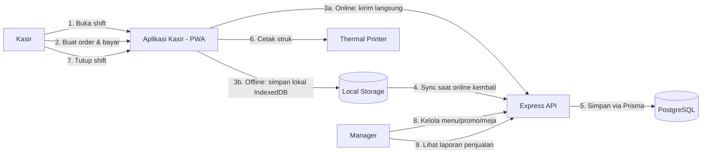
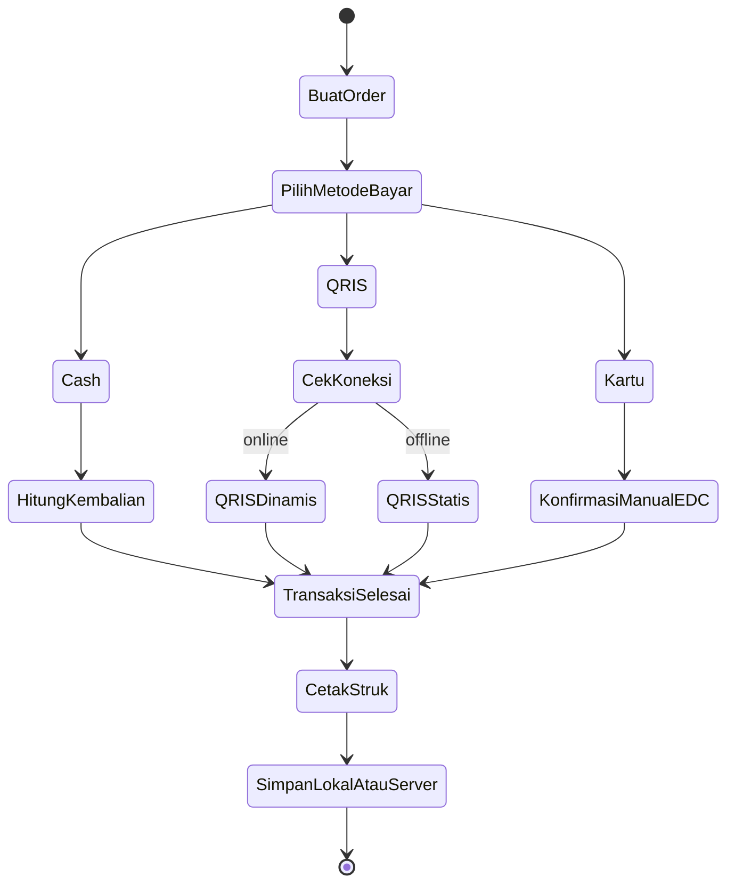
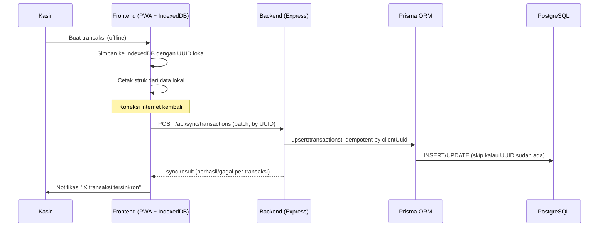
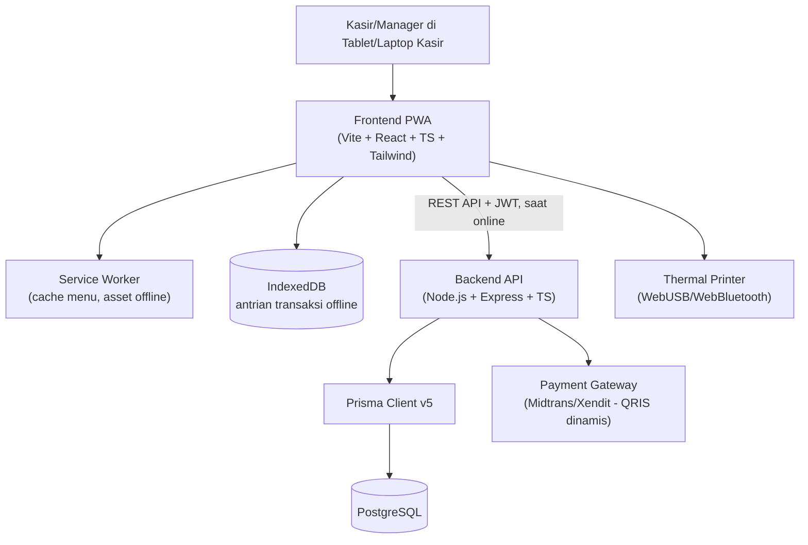
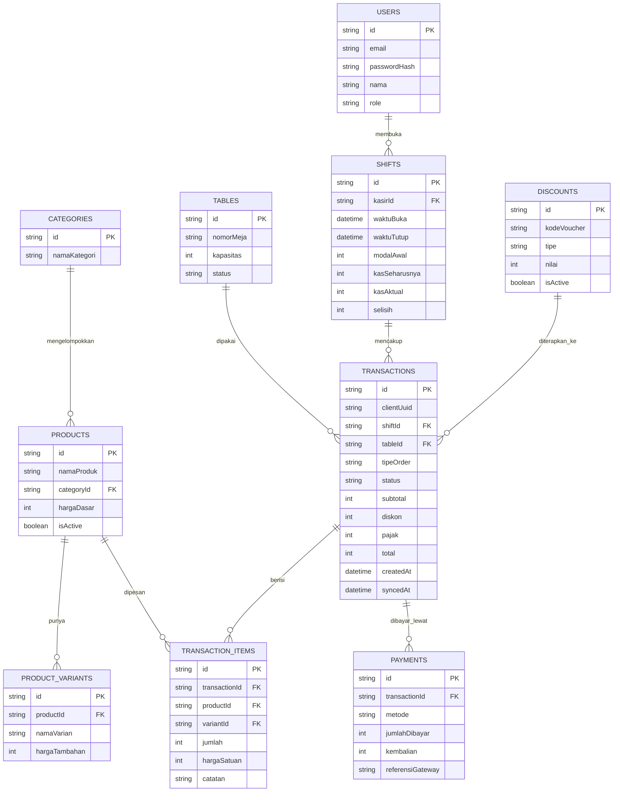

# PRD — Project Requirements Document

## Assumptions
- Sistem digunakan untuk **satu outlet cafe** (single-tenant, single-lokasi) — bukan sistem multi-cabang.
- Cafe punya menu dengan **varian/modifier** (misal ukuran, level gula, topping tambahan) yang memengaruhi harga.
- Ada dua tipe order: **Dine-in** (perlu nomor meja) dan **Take Away** (tanpa meja).
- Metode pembayaran yang didukung: **Cash**, **QRIS**, dan **Kartu Debit/Kredit (EDC)**.
  - Cash & Kartu (via mesin EDC fisik bank) **tidak butuh internet dari sisi aplikasi** — kasir input jumlah dibayar/konfirmasi kartu secara manual setelah transaksi fisik selesai.
  - QRIS dinamis (generate kode unik per transaksi via payment gateway seperti Midtrans/Xendit) **butuh internet saat transaksi itu terjadi**. Kalau offline, kasir cuma bisa pakai QRIS statis (kode QR tetap yang ditempel di meja kasir, dikonfirmasi manual) atau alihkan ke Cash/Kartu.
- **Mode offline wajib** — kasir tetap bisa input & selesaikan transaksi (Cash/Kartu/QRIS statis) walau internet putus; transaksi disimpan lokal dan disinkronkan ke server begitu koneksi kembali.
- Reuse stack yang konsisten dengan project-project sebelumnya: **Vite + React + TypeScript + TailwindCSS** (dibangun sebagai **PWA**) di frontend, **Node.js + Express + TypeScript + Prisma v5** di backend, **PostgreSQL** sebagai database utama, **JWT** untuk auth kasir/manager.
- Struk dicetak ke **thermal printer** (umum dipakai cafe) — diasumsikan terhubung via USB/Bluetooth ke perangkat kasir, diakses lewat WebUSB/WebBluetooth atau print-service kecil di perangkat kasir (bukan dari server).
- Cetak struk & tampilan kasir jadi prioritas utama; integrasi dengan sistem inventory bahan baku (resep/BOM) **belum termasuk MVP**, hanya dicatat sebagai Nice to Have.

---

## 1. Overview
Project ini adalah **Sistem POS (Point of Sale) untuk Cafe** berbasis web (PWA) yang menangani pencatatan menu, transaksi penjualan di kasir, multi-metode pembayaran, cetak struk, manajemen shift kasir, dan laporan penjualan — dengan kemampuan **tetap bisa bertransaksi walau internet mati** (offline-first).

Masalah yang diselesaikan: Kasir cafe sering terganggu kalau koneksi internet putus (POS berbasis cloud biasanya macet total), pencatatan pembayaran campur cash/QRIS/kartu gampang selisih di akhir shift, dan laporan penjualan manual (buku/Excel) telat & rawan salah hitung.

Pengguna utama: Kasir (input & proses transaksi harian), Manager/Owner (kelola menu, harga, promo, lihat laporan penjualan, rekonsiliasi shift).

Tujuan utama: Menyediakan satu sistem kasir yang:
- Tetap bisa dipakai transaksi walau internet mati (**offline-first**, sync otomatis saat online lagi),
- Mendukung **Cash, QRIS, dan Kartu** dalam satu alur pembayaran,
- Mencatat **shift kasir** (modal awal, kas aktual vs seharusnya) supaya gampang direkonsiliasi,
- Memberi **laporan penjualan** harian/per item/per kasir/per metode pembayaran secara instan.

Nilai utama aplikasi:
✅ Transaksi tidak pernah berhenti gara-gara internet mati
✅ Satu alur untuk tiga metode pembayaran berbeda
✅ Shift kasir tercatat rapi, gampang direkonsiliasi
✅ Laporan penjualan real-time, tidak perlu rekap manual

---

## 2. Requirements

| Kategori | Detail |
|---------|--------|
| **Aksesibilitas platform** | Web app sebagai **PWA** (bisa di-install di tablet/laptop kasir, jalan walau offline); frontend Vite + React + TypeScript; backend REST API Node.js + Express + Prisma v5; database PostgreSQL |
| **Target pengguna** | Kasir cafe (harian), Manager/Owner (kelola menu & laporan) |
| **Role user** | `kasir` (input transaksi, buka/tutup shift), `manager` (kelola menu, harga, promo, meja, lihat semua laporan & shift) |
| **Input data utama** | - Master menu (kategori, produk, varian, harga)<br>- Data meja (untuk dine-in)<br>- Order dari kasir (produk + varian + jumlah)<br>- Pembayaran (metode + jumlah dibayar)<br>- Modal awal & kas aktual shift |
| **Output utama** | - Transaksi tersimpan (lokal dulu kalau offline, lalu sync ke server)<br>- Struk cetak (thermal printer)<br>- Ringkasan shift (kas seharusnya vs aktual, selisih)<br>- Laporan penjualan (harian, per item, per kasir, per metode pembayaran) |
| **Kebutuhan autentikasi** | JWT (access + refresh token) + `bcrypt`; token & data menu di-cache lokal di device supaya kasir tetap bisa login & jalan transaksi walau offline (session grace period) |
| **Kebutuhan notifikasi** | In-app saja — notifikasi sync berhasil/gagal, notifikasi shift belum ditutup, alert kalau ada transaksi lokal yang gagal sync setelah beberapa kali retry |
| **Kebutuhan dashboard/laporan** | Ada — laporan penjualan harian/mingguan, produk terlaris, breakdown per metode pembayaran, riwayat shift & selisih kas per kasir |
| **Kebutuhan offline** | Kasir bisa: buka aplikasi, lihat menu (dari cache lokal), buat transaksi, terima pembayaran Cash/Kartu/QRIS statis, cetak struk — semua tanpa internet; transaksi otomatis sync ke server saat koneksi kembali |
| **Batasan MVP** | - Tidak ada integrasi resep/BOM ke stok bahan baku<br>- Tidak ada multi-outlet/cabang<br>- QRIS dinamis (generate kode unik per transaksi via gateway) butuh internet — tidak bisa dipakai saat offline<br>- Integrasi EDC bank spesifik (auto-settlement) belum ada, kartu dicatat manual oleh kasir |

---

## 3. Core Features

| Fitur | Fungsi Utama | Input | Output | Catatan Logic |
|-------|--------------|-------|--------|----------------|
| **Manajemen Menu** | Manager CRUD kategori, produk, varian/modifier (ukuran, topping, level gula) beserta harga | Nama produk, kategori, harga dasar, daftar varian + harga tambahan | Row di `categories`, `products`, `product_variants` via Prisma | Perubahan menu di-sync ke cache lokal tiap device kasir buka aplikasi (atau berkala) supaya kasir tetap lihat menu terbaru saat online |
| **Manajemen Meja** | Manager kelola daftar meja (nomor, kapasitas) untuk order Dine-in | Nomor meja, kapasitas | Row di `tables` | Status meja: `Kosong`, `Terisi` — dipilih kasir saat buat order Dine-in |
| **Transaksi Kasir (Order & Pembayaran)** | Kasir pilih produk+varian, atur jumlah, pilih tipe order (Dine-in/Take Away), terima pembayaran (Cash/QRIS/Kartu), selesaikan transaksi | Item order, tipe order, metode pembayaran, jumlah dibayar | Transaksi tersimpan lokal (IndexedDB) dengan UUID unik dulu, lalu sync ke `transactions`+`transaction_items`+`payments` di server saat online | Cash: sistem hitung kembalian otomatis. QRIS: kalau online, generate kode dinamis via payment gateway & tunggu callback; kalau offline, pakai QRIS statis (kasir konfirmasi manual). Kartu: kasir input nominal, konfirmasi manual setelah transaksi di mesin EDC selesai |
| **Mode Offline & Sinkronisasi** | Menyimpan transaksi ke penyimpanan lokal device saat tidak ada koneksi, lalu otomatis sync begitu online lagi | Event online/offline browser, antrian transaksi lokal | Transaksi ter-upload ke `POST /api/sync/transactions` (batch, idempotent by UUID klien) | Deteksi status koneksi via `navigator.onLine` + event listener; retry otomatis dengan backoff; kasir bisa lihat indikator "X transaksi belum tersinkron" |
| **Cetak Struk** | Cetak struk ke thermal printer setelah transaksi selesai (baik online maupun offline) | Data transaksi yang sudah final | Perintah cetak ke printer via WebUSB/WebBluetooth atau print-service lokal | Struk tetap bisa dicetak walau transaksi belum sync ke server — data diambil dari state lokal |
| **Manajemen Shift Kasir** | Kasir buka shift (input modal awal) di awal kerja, tutup shift (input kas aktual) di akhir, sistem hitung selisih | Modal awal, kas aktual saat tutup | Row di `shifts`; total transaksi Cash selama shift dihitung otomatis jadi "kas seharusnya" | Kasir tidak bisa membuat transaksi baru kalau belum buka shift; laporan shift dikunci setelah ditutup |
| **Diskon & Promo** | Manager buat kode voucher/diskon (persentase atau nominal), kasir terapkan ke transaksi | Kode voucher, nilai, syarat (min. belanja) | Row di `discounts`; potongan tercermin di `transactions.diskon` | Validasi kode voucher aktif & syarat terpenuhi sebelum diterapkan; kalau offline, validasi pakai daftar voucher aktif yang di-cache lokal |
| **Laporan Penjualan** | Manager lihat ringkasan penjualan harian/mingguan, produk terlaris, breakdown metode pembayaran, riwayat shift | Filter tanggal, kasir | Chart & tabel dari endpoint `GET /api/reports` | Data yang belum sync dari device kasir belum masuk laporan server — indikator "terakhir update: [waktu sync terakhir]" ditampilkan di dashboard |

**Opsional**:
- **Split bill** (satu order dibayar terpisah oleh beberapa orang).
- **Cetak ulang struk** dari riwayat transaksi.
- **Kirim struk digital** (email/WA) sebagai pengganti/tambahan struk fisik.

---

## 4. User Flow & Use Case

### User Flow (Kasir — transaksi normal, online)
1. Kasir login di awal shift → buka shift (input modal awal kas).
2. Kasir pilih produk & varian sesuai pesanan pelanggan, pilih tipe order (Dine-in + nomor meja / Take Away).
3. Kasir pilih metode pembayaran: Cash (input jumlah dibayar, sistem hitung kembalian), QRIS (generate kode dinamis, tunggu konfirmasi gateway), atau Kartu (proses di EDC fisik, konfirmasi manual di aplikasi).
4. Transaksi selesai → tersimpan ke server, struk otomatis dicetak.
5. Di akhir shift, kasir tutup shift → input kas aktual → sistem tampilkan selisih vs kas seharusnya.

### User Flow (Kasir — transaksi saat offline)
1. Aplikasi mendeteksi tidak ada koneksi (indikator "Mode Offline" muncul).
2. Kasir tetap bisa buat order & pilih metode pembayaran (Cash/Kartu/QRIS statis) — QRIS dinamis dinonaktifkan sementara.
3. Transaksi disimpan ke penyimpanan lokal device, struk tetap bisa dicetak.
4. Begitu internet kembali, aplikasi otomatis sync semua transaksi tertunda ke server; kasir dapat notifikasi "X transaksi berhasil disinkronkan".

### Use Case Diagram


---

## 5. System Diagrams

### Activity Diagram (Transaksi)


### Sequence Diagram (Sync Offline → Online)


### Architecture Diagram


---

## 6. Database Schema



Contoh potongan `schema.prisma` (model inti):
```prisma
model Transaction {
  id          String    @id @default(uuid())
  clientUuid  String    @unique
  shiftId     String
  tableId     String?
  tipeOrder   String
  status      String    @default("paid")
  subtotal    Int
  diskon      Int       @default(0)
  pajak       Int       @default(0)
  total       Int
  createdAt   DateTime
  syncedAt    DateTime?

  shift    Shift              @relation(fields: [shiftId], references: [id])
  items    TransactionItem[]
  payments Payment[]
}

model Shift {
  id            String    @id @default(uuid())
  kasirId       String
  waktuBuka     DateTime
  waktuTutup    DateTime?
  modalAwal     Int
  kasSeharusnya Int?
  kasAktual     Int?
  selisih       Int?

  kasir        User          @relation(fields: [kasirId], references: [id])
  transactions Transaction[]
}
```

Penjelasan kolom penting:
| Kolom | Tabel | Deskripsi |
|--------|-------|-----------|
| `clientUuid` | `Transaction` | UUID digenerate di device kasir saat transaksi dibuat (online atau offline) — jadi kunci idempoten saat sync ke server, mencegah transaksi tersimpan dobel |
| `syncedAt` | `Transaction` | Null selama transaksi masih di penyimpanan lokal/belum berhasil sync; diisi timestamp server begitu berhasil diterima |
| `kasSeharusnya` / `kasAktual` / `selisih` | `Shift` | `kasSeharusnya` dihitung otomatis dari total transaksi Cash selama shift; `kasAktual` diinput kasir manual saat tutup shift; `selisih = kasAktual - kasSeharusnya` |
| `metode` | `Payment` | `cash`, `qris`, atau `kartu` |
| `referensiGateway` | `Payment` | Nomor referensi dari payment gateway (khusus QRIS dinamis), null untuk cash/kartu/QRIS statis |

---

## 7. Design & Technical Constraints

1. **High-Level Technology**
   - Frontend: Vite + React 18 + TypeScript + TailwindCSS, dibangun sebagai **PWA** (`vite-plugin-pwa`)
   - Local storage offline: **IndexedDB** lewat **Dexie.js** (antrian transaksi, cache menu & voucher aktif)
   - State/data fetching: TanStack Query (React Query) dengan strategi cache-first untuk data menu
   - Backend: Node.js + Express + TypeScript, ORM **Prisma v5**, database **PostgreSQL**
   - Payment gateway (QRIS dinamis): Midtrans atau Xendit (pilih salah satu saat implementasi)
   - Cetak struk: WebUSB/WebBluetooth API ke thermal printer, atau print-service kecil lokal kalau printer tidak didukung browser langsung
   - Auth: JWT (access + refresh token) + `bcrypt`
   - Hosting: Backend + PostgreSQL di VPS/Railway/Render; frontend PWA di-serve statis (Vercel/Netlify) atau langsung dari device kasir

2. **UI/UX Direction**
   - Layar kasir didesain **touch-friendly** (tombol besar, grid produk dengan gambar), cocok dipakai di tablet
   - Indikator status koneksi jelas di top bar: "Online" (hijau) vs "Mode Offline" (kuning/merah) + counter "X transaksi belum tersinkron"
   - Alur pembayaran satu layar (order summary + pilih metode bayar + konfirmasi) supaya cepat dipakai pas jam sibuk
   - Struk digital preview sebelum cetak, dengan tombol "Cetak Ulang" tersedia di riwayat transaksi
   - Dashboard manager: ringkasan penjualan hari ini di atas, grafik tren di bawah, tabel produk terlaris

3. **Typography Rules**
   - Sans: `Inter`, `ui-sans-serif`, `sans-serif` *(UI utama)*
   - Mono: `JetBrains Mono`, `ui-monospace`, `monospace` *(nomor transaksi/referensi pembayaran)*

4. **Development Constraints**
   - Semua transaksi **wajib punya `clientUuid`** yang digenerate di frontend (bukan di server), supaya proses sync offline→online idempoten
   - Endpoint sync (`POST /api/sync/transactions`) harus **upsert by `clientUuid`**, bukan `create` biasa — mencegah transaksi dobel kalau sync gagal di tengah jalan dan diulang
   - Perhitungan `kasSeharusnya` di shift **wajib dihitung di backend** dari data `Transaction`+`Payment` asli, jangan percaya angka yang dikirim frontend
   - Cache menu di IndexedDB harus di-refresh tiap kali online & ada perubahan menu, supaya kasir gak jual produk yang sudah dihapus/diubah harganya
   - QRIS dinamis hanya boleh diaktifkan kalau `navigator.onLine` true DAN request ke payment gateway berhasil — kalau gagal, fallback otomatis ke opsi QRIS statis/Cash/Kartu

---

## 8. Acceptance Criteria

✅ **AC1 — Transaksi Tetap Jalan Saat Offline**
Kasir bisa membuat transaksi lengkap (order + pembayaran Cash/Kartu/QRIS statis + cetak struk) tanpa koneksi internet sama sekali, dan transaksi tersebut tersimpan aman di device.

✅ **AC2 — Sync Otomatis & Idempoten**
Begitu koneksi internet kembali, semua transaksi offline tersinkron ke server tanpa duplikat, bahkan kalau proses sync sempat gagal di tengah dan diulang.

✅ **AC3 — Tiga Metode Pembayaran**
Kasir bisa menyelesaikan transaksi dengan Cash (kembalian dihitung otomatis), QRIS (dinamis saat online / statis saat offline), dan Kartu (konfirmasi manual), dan ketiganya tercatat benar di laporan.

✅ **AC4 — Shift & Rekonsiliasi Kas**
Kasir wajib buka shift sebelum bertransaksi; saat tutup shift, sistem menghitung `kasSeharusnya` dari transaksi Cash secara otomatis dan menampilkan selisih terhadap `kasAktual` yang diinput kasir.

✅ **AC5 — Cetak Struk Konsisten**
Struk berhasil dicetak baik dalam kondisi online maupun offline, dengan data yang identik dengan yang tersimpan di transaksi.

✅ **AC6 — Laporan Penjualan Akurat**
Laporan penjualan di dashboard manager mencerminkan seluruh transaksi yang sudah tersinkron, dengan indikator jelas kalau ada transaksi dari device kasir yang belum masuk (belum sync).

---

## 9. MVP Scope

### Must Have
- Auth (JWT + bcrypt) dengan role: kasir, manager
- Manajemen menu (kategori, produk, varian) & manajemen meja
- Transaksi kasir: order, tiga metode pembayaran (Cash/QRIS/Kartu), cetak struk
- Mode offline penuh: buat transaksi, bayar, cetak struk tanpa internet
- Sync otomatis & idempoten saat online kembali
- Manajemen shift kasir (buka/tutup, hitung selisih kas)
- Laporan penjualan dasar (harian, per metode pembayaran, per kasir)

### Should Have
- Diskon & voucher
- Laporan produk terlaris & tren mingguan
- Cetak ulang struk dari riwayat transaksi

### Nice to Have
- Split bill
- Kirim struk digital (email/WA)
- Integrasi resep/BOM ke sistem stok bahan baku
- Multi-outlet/cabang

---

## 10. AI Coding Notes

- **Urutan pengerjaan wajib**: Setup `schema.prisma` & migration → Auth → Manajemen Menu & Meja → Transaksi Kasir (online dulu, alur lengkap tiga metode bayar) → Layer offline (IndexedDB + service worker) → Sync engine → Manajemen Shift → Laporan. **Jangan bangun offline layer sebelum alur transaksi online penuh jalan dan teruji** — offline cuma nambah lapisan penyimpanan & sync di atas alur yang sudah benar.
- **Modul pertama**: `schema.prisma` dengan `User`, `Category`, `Product`, `ProductVariant`, `Table` → `prisma migrate dev --name init`, seed beberapa produk contoh.
- **Komponen/logic yang wajib di-test**:
  - `TransactionSyncEngine` (frontend) → pastikan retry dengan backoff, dan tidak pernah mengirim ulang transaksi yang sudah dikonfirmasi server (cek status lokal sebelum retry)
  - Endpoint `POST /api/sync/transactions` → test idempotensi: kirim payload yang sama 2x, hasil di DB harus tetap 1 row per `clientUuid`
  - `calculateShiftReconciliation()` (backend) → pastikan `kasSeharusnya` selalu dihitung ulang dari `Payment` metode Cash yang tersimpan di DB, bukan dari input manapun dari frontend
  - Fallback QRIS dinamis → offline → statis harus otomatis, bukan bikin kasir stuck kalau gateway gagal/timeout
- **Jangan dibuat dulu**: Integrasi EDC bank spesifik (auto-settlement), integrasi resep/BOM, multi-outlet, split bill.
- **Risiko teknis utama**:
  - Konflik data kalau dua device kasir tidak sengaja pakai shift/meja yang sama secara offline → mitigasi: shift & meja tetap harus dicek servernya saat device online lagi sebelum buka shift baru; kalau konflik terdeteksi, tampilkan warning ke kasir, jangan auto-merge diam-diam
  - Cache menu basi (kasir jual produk yang sudah dihapus/harga lama) selama periode offline panjang → mitigasi: tampilkan timestamp "Menu terakhir update: [waktu]" di layar kasir, dan blok transaksi produk yang di-nonaktifkan setelah sync berikutnya
  - WebUSB/WebBluetooth printer support terbatas di beberapa browser → mitigasi: siapkan fallback print-service lokal (kecil, jalan di background device kasir) kalau target browser tidak didukung
- **Validasi penting**:
  - `clientUuid` harus digenerate sekali di awal pembuatan order (bukan di-generate ulang tiap retry), supaya idempotensi sync benar-benar jalan
  - Transaksi tidak boleh dibuat kalau kasir belum ada shift aktif yang terbuka

---

## 11. Recommended Development Order

1. Setup project: `npm create vite@latest` (React + TS) untuk frontend PWA; project backend terpisah (`npm init` + Express + TypeScript + `prisma init`)
2. Definisikan `schema.prisma`: `User`, `Category`, `Product`, `ProductVariant`, `Table`, `Shift`, `Transaction`, `TransactionItem`, `Payment`, `Discount` → `prisma migrate dev`
3. Implement Auth flow + role middleware (kasir, manager)
4. Implement Manajemen Menu & Meja (CRUD manager)
5. Implement alur Transaksi Kasir **online dulu** — order builder, tiga metode pembayaran, hitung kembalian/diskon/pajak
6. Implement Manajemen Shift (buka/tutup, hitung `kasSeharusnya` di backend)
7. Integrasikan payment gateway untuk QRIS dinamis (Midtrans/Xendit sandbox)
8. Implement cetak struk (WebUSB/WebBluetooth atau print-service lokal)
9. Tambahkan layer offline: setup PWA (`vite-plugin-pwa`), IndexedDB via Dexie untuk cache menu & antrian transaksi
10. Implement sync engine (`POST /api/sync/transactions`, idempotent by `clientUuid`) + indikator status koneksi di UI
11. Implement Laporan Penjualan (harian, per metode bayar, per kasir) di dashboard manager
12. End-to-end testing: transaksi online, transaksi offline → online lagi (cek sync tidak dobel), tutup shift → cek selisih kas
13. Dokumentasi: `README.md` setup `.env` (DB URL, JWT secret, kredensial payment gateway), cara `prisma migrate`, cara test mode offline (matiin network di DevTools)

---
✅ PRD siap untuk *vibe coding*. Skema konsisten untuk POS single-outlet dengan mode offline-first dan tiga metode pembayaran, stack sama seperti project-project sebelumnya (Vite + Express + Prisma v5).
